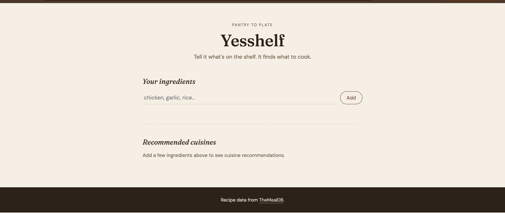

# MP3
Mini Project 3 for OIM 3690 Summer 2026

# Yesshelf

A "what can I cook with what I have" app. You type in the ingredients sitting in your kitchen, and it tells you which cuisines you can actually make something from, then shows you ranked dish suggestions — with a full breakdown of what you have and what you're still missing for each recipe.

## What it does

1. **Add ingredients** you have on hand (chicken, garlic, rice, whatever's in the fridge).
2. **Get cuisine recommendations** — the app checks which cuisines actually have recipes matching your ingredients, and shows them as options with a match count (e.g. "Indian — 8 dishes"), plus an "Any cuisine" option to skip straight to everything.
3. **Browse ranked dishes** — recipes are sorted by how many of your ingredients they actually use, so the best matches show up first.
4. **Click into a recipe** for the full ingredient list (what you have vs. what you're missing) and the full cooking instructions.

## API used

[TheMealDB](https://www.themealdb.com/api.php) — a free, no-key-required recipe API. This app uses:
- `filter.php?i=` — find recipes by ingredient
- `filter.php?a=` — find recipes by cuisine/area
- `list.php?a=list` — get the full list of cuisines
- `lookup.php?i=` — get full recipe details (ingredients, measurements, instructions)

## Live site

https://rtotlani1.github.io/MP3/

## Screenshot

